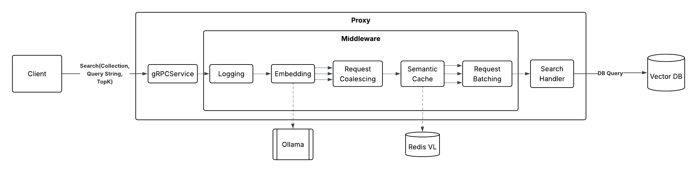

# High-Performance Vector Database Proxy (VecProxy)

VecProxy is a specialized high-performance middleware proxy designed to sit transparently between client applications and backend vector databases (such as Qdrant, Milvus, or Pinecone). Its core goals are to **decouple applications from embedding APIs** by automatically generating embeddings in flight, and to **optimize database throughput** by mitigating search load via micro-batching, in-flight coalescing, and semantic caching. 

Built in Go, it leverages a modular, synchronous interceptor pipeline to augment queries and manage request lifecycles.

---

## 2. Installation Instructions

### Prerequisites
*   **Go** (version `1.26.2` or later)
*   **Ollama** running locally with the embedding model pulled:
    ```bash
    ollama pull nomic-embed-text
    ```
*   **Qdrant** running locally on `localhost:6334` (gRPC port).
*   **Redis** running locally on `localhost:6379` (used for the Semantic Cache).
*   **Docker Compose** (optional, for running the observability stack).

### Running the Proxy
Clone the repository and start the proxy on port `:50051`:
```bash
go mod tidy
go run cmd/proxy/main.go
```

The proxy will connect to Qdrant, Ollama, and Redis, and expose the gRPC service.

---

## 3. Usage & API Examples

VectorProxy exposes a gRPC service defined in `proto/proxy/v1/proxy.proto`. You can interact with it using any gRPC client (such as `grpcurl` or standard language bindings).

### Search Example
When you perform a search, you pass a raw string `query` and the proxy will automatically embed the query, cache the embedding, coalesce identical inflight requests, check the semantic cache, and perform micro-batching.

```bash
# Example using grpcurl
grpcurl -plaintext -d '{
  "collection": "my_knowledge_base",
  "query": "What are the latest machine learning trends?",
  "topK": 5
}' localhost:50051 proxy.v1.ProxyService.Search
```

### Upsert Example
You can also use the proxy to insert data. The proxy will seamlessly pass the request directly to the backend vector database (bypassing caches and batching).

```bash
grpcurl -plaintext -d '{
  "collection": "my_knowledge_base",
  "points": [
    {
      "id": "doc1",
      "content": "Retrieval-Augmented Generation is a popular trend...",
      "payload": {
        "source": "blog_post"
      }
    }
  ]
}' localhost:50051 proxy.v1.ProxyService.Upsert
```

---

## 4. Core Architecture



VectorProxy utilizes a modular **Interceptor Pipeline**. A gRPC request flows through several distinct middleware components before it ever reaches the database:

1. **Semantic Cache**: Checks Redis for previous search results that are highly semantically similar (e.g., using Cosine Distance) to the incoming query. If a match is found within a defined similarity threshold, it bypasses the database completely.
2. **Embedding Interceptor**: Receives raw text strings from the user, forwards them to an external embedding provider (like Ollama), and injects the resulting float vectors back into the request context.
3. **Request Coalescer**: Stops the "thundering herd" problem. If 100 users search for the exact same term at the same millisecond, this interceptor groups them into a single flight, queries the database once, and fans out the response to all 100 users.
4. **Micro-Batching Engine**: Accumulates individual query requests over a tiny window (e.g., 10ms - 50ms). Once the window closes or the batch is full, it flushes all requests in a single network call as a batch request, massively increasing DB throughput.
5. **Backend Vector Store Client**: The final driver that talks directly to Qdrant, Milvus, or Pinecone.

---

## 5. Observation & Telemetry

VectorProxy comes with a fully automated, production-ready observability stack out of the box using Prometheus and Grafana.

Metrics are continuously exposed by the proxy on port `:50052/metrics`.

### Starting the Observability Stack
To spin up Prometheus and Grafana:
```bash
cd deploy
docker compose up -d
```

### Available Dashboards
Navigate to `http://localhost:3000` in your browser. The stack is pre-provisioned (no login required) with a specialized dashboard tracking:
*   **Requests Per Second (RPS)**
*   **End-to-End Latency** (P50 and P99)
*   **Upstream Latencies** (Ollama embedding durations vs Qdrant search durations)
*   **Cache Performance** (Semantic hit rates)
*   **Coalescing Efficiency** (Count of duplicated requests caught and blocked in-flight)
*   **Batch Sizes** (Live tracking of the micro-batcher's accumulation rates)
